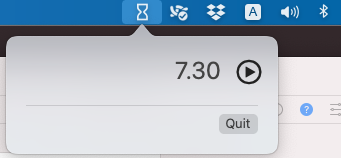

# Quannu The Timer

Quannu is another timer app for Mac

Why to prefer Quannu to the other amazing Timer apps already existing?

• Quanno is free (and open source), without Ads or Pro versions

• The UI is clean and easy to use

• Enter the time typing the text, no needs to click here and there, just type and press ENTER

• You can select the sound from your own collection of files

## How to set up timers

You must type the timer expression, no beautiful but less useful time wheels, just type the text

### Absolute time

Allow to set a specific hour, minute (and second) using the `:` or `.` separators

Enter `8:10` or `16.34` or `22:00:57`

### Relative time

Allow to set a timer starting from the current time

Fire the timer in 12 minutes (starting from the current time) `12m`

The allowed suffixes are

| Suffix | Description |
|--------|-------------|
| s      | seconds     |
| m      | minutes     |
| h      | hours.      |

Examples: `3h22m4s` or `4h10s`
